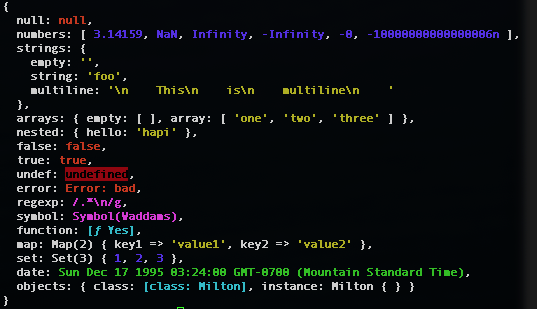

# Milton

*Now Milton, don't be greedy; let's pass it along and make sure everyone gets a piece*


## Goals

Milton is a a extendable tool to stringify JS objects.  Co-worker of [Smykowski](https://github.com/Hypercubed/smykowski).

## Features (see [Extension](#extension) below)

- ANSI colorized output
- Cyclical objects/arrays
- Additional types (`undefined`, `±Infinity`, `NaN`, `-0`)
- Objects (`RegExp`, `Date`, `Map` and `Set`)
- Classes and class instances
- Extendable

## Install

```bash
npm i @hypercubed/milton
```

## Usage

```js
import { Milton, pretty, colorize } from '@hypercubed/milton';

const milton = new Milton();
milton.use(pretty);

const obj = {
  json: {
    null: null,
    integer: 1580349408812,
    float: 0.4852754432812123,
    strings: {
      empty: '',
      string: 'foo',
      multiline: `
        This
        is
        multiline
      `
    },
    arrays: {
      empty: [],
      array: [ 'one', 'two', 'three' ],
    },
    nested: { hello: 'hapi' },
    booleans: {
      false: false,
      true: true
    }
  },
  otherTypes: {
    undef: undefined,
    error: new Error('bad'),
    regexp: /.*\n/g,
    symbol: Symbol('Waddams'),
    function: function Yes() { /* noop */ },
    map: new Map([['key1', 'value1'], ['key2', 'value2']]),
    set: new Set([1, 2, 3]),
    date: new Date('1995-12-17T03:24:00'),
    numbers: [NaN, Infinity, -Infinity, -0],
    void: void 0
  },
  objects: {
    class: Milton,
    instance: milton
  }
};

const stringified = milton.stringify(obj);
console.log(stringified);
```

prints:

```
{
  json: {
    null: null,
    integer: 1580349408812,
    float: 0.4852754432812123,
    strings: {
      empty: "",
      string: "foo",
      multiline: "\n        This\n        is\n        multiline\n      "
    },
    arrays: { empty: [ ], array: [ "one", "two", "three" ] },
    nested: { hello: "hapi" },
    booleans: { false: false, true: true }
  },
  otherTypes: {
    undef: undefined,
    error: Error: bad,
    regexp: /.*\n/g,
    symbol: Symbol(Waddams),
    function: [ƒ: Yes],
    map: Map(2) [
        [ "key1", "value1" ],
        [ "key2", "value2" ]
    ],
    set: Set(3) [ 1, 2, 3 ],
    date: Sun Dec 17 1995 03:24:00 GMT-0700 (Mountain Standard Time),
    numbers: [
      NaN,
      Infinity,
      -Infinity,
      -0
    ],
    void: undefined
  },
  objects: { class: [class: Milton], instance: Milton { } }
}
```

add the `colorize` plugin:

```js
milton.add(colorize);

const colorized = milton.stringify(obj);
console.log(colorized);
```

will print:



## Description

`Milton` is an interface for processing JS objects.  In `Milton` we have a concept of plugins and presets. Plugins are functions that define a "replacer" functions.  Replacer functions accept each value and returns a stringified result.  The value returned by the replacer function replaces the original value in the stringified result. If it returns `undefined` the property will be removed. If it returns the existing value it will be unchanged.  Values returned from one replacer are passed down to the next.  Plugins are added using the `.add` method on a `Milton` instance.  The order of the plugins does matter.  Plugins that stringify values should come first, followed by plugins that format the results.

```ascii
| ........................ stringify ........................... |

          +----------+    +----------+    +----------+
Input  -> | Replacer | -> | Replacer | -> | Replacer | -> Output
          +----------+    +----------+    +----------+

```

Presets are sets of plugins.  You may use a preset using the `.use` method on a milton instance.

## Presets

- `json` - Reproduces, as much as possible, the built in `JSON.stringify`.
- `js` - Extends the `json` plugin to support addition types, printed as JS compatible code (e.g. `new Date("1995-12-17T10:24:00.000Z")`)
- `pretty` - Pretty prints objects and values, similar to the browser's console output or node's `util.inspect`.

## Plugins

- `colorize` - Colorizes output based on types.

## API

### Class `Milton`

`new Milton()`

#### Method `milton.add(plugin[, options])`

```ts
add(plugin: Plugin, options?: any) => this
```

* `plugin` - A function that initializes returns a replacer
* `options` (optional, default = null) — Configuration for plugin

#### Method `milton.use(preset)`

```ts
use(preset: Preset, options: any) => this
```

* `preset` - A adds plugins to a milton instance in the desired order

#### Method `milton.stringify(value)`

```ts
stringify(value: any) => string
```

* `value` - any JS value supported by the plugins

Pass the value throuhgt the added replacers.

### `Replacer`

`function replacer(s, p, v)`

```ts
type Replacer = (s: unknown, p: Path, value: unknown) => unknown | string;
```

### `Plugin`

`function plugin(options, root, get)`

```ts
type Plugin = (options: any, root: any, get: StringifyFunction) => Replacer;
```

### `Preset`

`function preset(milton)`

```ts
type Preset = (milton: Milton) => Milton;
```

## Writing Plugins and Presets

TBD

## License

This project is licensed under the MIT License - see the LICENSE file for details